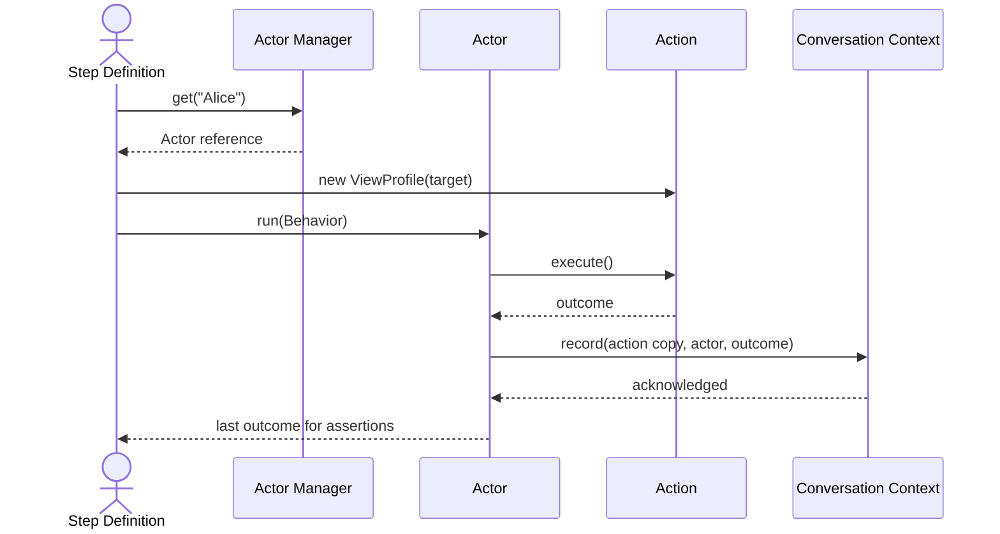

# Third-Person BDD: Building Automation That Mirrors Real Conversations

## Why Revisit Classic BDD?

Most BDD frameworks grew around a single narrator. "Given I log in" feels natural until a scenario involves three users, a background job, and asynchronous fallout. Teams respond by stashing state in step-definition fields, inventing helper classes, and quietly enforcing rules about who can run which step. The test harness becomes a gatekeeper instead of a witness. Negative paths turn into fiction because the framework refuses to even try the forbidden action.

Re-centering BDD on observable conversations fixes this. The product should decide whether an action succeeds. The test harness should document what each actor attempted and what outcome the product revealed. Do it right and you end up with a small library of personas, actions, and named outcomes that you compose like sentences; writing tests becomes trivial because you are just arranging those building blocks. Everything else is ceremony.

## Where Traditional Habits Break

- **Narrator bias.** Collapsing multiple personas into "I" or "my" hides important context. You can no longer tell which user triggered which effect.
- **Shared secret state.** Step classes that hold onto mutable fields silently couple every step order. Flaky tests are inevitable.
- **Protective helpers.** Utilities that refuse to execute "invalid" actions make it impossible to assert that the product blocks them.
- **One-size actions.** Giant helper methods that serve every scenario force unrelated behaviors to evolve together. Intent gets smeared.

Recognizing these failure modes keeps you honest when redesigning your framework.

## Core Ideas of the Third-Person Frame

### Actors Are Named Personas

A scenario should read like a meeting transcript. Every participant is introduced by name, and every step says which actor is speaking or acting. Pronouns still work, but they resolve deterministically through an actor registry so "she" always points to the same persona, not whichever step happened last.

```gherkin
Scenario: Buyer reviews a shipment request
  Given Alice is a registered buyer
  And Marco is the assigned seller
  When Alice approves the shipment from Marco
  Then Alice should see Marco's confirmation token
  And Marco should receive Alice's approval event
```
This scenario shows how naming both personas explicitly keeps every step unambiguous. If the test said "I approve," the reader would instantly lose track of who performed the action.

### Actions Encapsulate Product Behavior

An action represents a single domain operation the product can perform: approve a claim, submit a transfer, revoke access. It prepares its own inputs, executes inside the product boundary, and records the resulting outcome. Actions are composable, meaning any actor can pick them up. They are never tied to a single persona or hidden state.

```gherkin
Scenario: Multiple moderators lock the same discussion
  Given Mei is a moderator
  And Hugo is a moderator
  When Mei locks discussion DISC-7
  And Hugo locks discussion DISC-7
  Then the latest lock outcome should record which moderator finished last
```
Here, the same action ("lock thread") is executed by two different actors without forking into actor-specific helpers, proving the action is reusable and stateless.

### Outcomes Are Observable Facts

Every action yields something the harness can observe. That might be an HTTP response, a UI change, an emitted event, or a database row. The test never relies on private fields or special hooks; it inspects what a real user or system could see. If nothing is observable, create instrumentation rather than fabricate assertions.

```gherkin
Scenario: Device audit log records firmware deployment
  Given Amir manages device DV-12
  When Amir deploys firmware FW-4.6 to DV-12
  Then the audit log should contain an entry for firmware FW-4.6 on DV-12
```
The assertion reads only from observable evidence—the audit log entry—instead of inspecting private fields or test-only hooks.

### Conversation Context Lives in One Place

The conversation needs a shared memory of the current subject ("it"), the last actor mentioned (pronouns), and the last action executed. Whatever language you use, provide a dedicated conduit for that context. Do not scatter it across member variables or helper singletons. Context exists only to keep the conversation coherent, not to shuttle arbitrary payloads between steps.

```gherkin
Scenario: Analysts act on the previously mentioned alert
  Given Ingrid flags alert AL-9 as critical
  When Jonas investigates it
  Then he should see the same alert data Ingrid saw
```
In this example, "it" and "the same alert data" both resolve through the shared conversation context rather than ad-hoc variables. Jonas is also identified as the last actor, so "he" maps correctly.


### Composition Beats Protection

Any actor should be able to attempt any action. If the product rejects the attempt, that rejection is the outcome you assert on. Framework code must not prevent the attempt, even when you expect failure. Injecting credentials or other actor-specific data should happen through composition (e.g., passing authentication into the action) rather than by creating separate action implementations per persona.

```gherkin
Scenario: Contractor tries to update payroll records
  Given Raul is a contractor
  And Mary is another employee
  When Raul opens Mary's payroll record
  Then he should receive an access denied response
```
The framework still routes Raul to the payroll action—only the product decides he cannot proceed, and that denial becomes the outcome under test.

## Working Model

1. **Introduce actors early.** A background or first step names every persona. Later steps reuse those labels or pronouns, keeping the conversation easy to follow.
2. **Register actors with a manager.** The manager maps labels and pronouns to actual actor objects. It also tracks which actor acted last so relative references make sense.
3. **Execute actions directly.** Each action exposes a single entry point (for example, `execute`). Actors call actions; actions talk to the product and capture outcomes.
4. **Store outcomes with the actor.** After an actor performs an action, attach the resulting outcome to that actor so later steps can learn from it without sharing global state.
5. **Use context sparingly.** When a step needs to refer to "them" or repeat "what just happened," read it from the context conduit, not from ad-hoc variables.

This pattern keeps steps thin: they choose the actor, pick the action, execute, and assert on the observed outcome.

Over time, implementing these steps yields a harness with three reusable libraries:

- a catalog of personas (actors),
- a catalog of domain actions,
- and a catalog of named outcomes.

When those libraries exist, writing tests becomes an exercise in composition rather than re-implementing behavior. You assemble actors, actions, and assertions like building blocks, and the system under test provides the story.

## Conceptual Components

The framework relies on a few tiny building blocks. Each one governs a single responsibility so scenarios stay composable. Collectively they become the libraries you reuse across tests: actors populate the persona catalog, actions populate the domain-operation catalog, and outcomes flow back through the context so assertions stay meaningful. Below, every component gets a description plus illustrative pseudo-code.

### Action

**Purpose:** encapsulate a single domain operation and expose the outcome.
**Why it matters:** actions represent user intent. When they stay stateless and copyable, any actor can reuse them without inheriting hidden context.

```
Action
  execute(): Outcome
  copy(): Action
```

### Actor

**Purpose:** run actions on behalf of a persona and push outcomes into the shared conversation context.
**Why it matters:** actors keep the transcript honest. They never hang onto global state; they just perform actions and report back.

```
Actor
  context: ConversationContext
  lastOutcome

  run(action):
    outcome = action.execute()
    lastOutcome = outcome
    context.record(action.copy(), this actor, outcome)
```

### ConversationContext

**Purpose:** track the subject, last actor, last action, and last outcome so relative references remain deterministic.
**Why it matters:** this is the only shared state between steps. Keeping it small prevents accidental coupling.

```
ConversationContext
  subject
  lastActor
  lastAction
  lastOutcome

  setSubject(value):
    subject = value

  record(action, actor, outcome):
    lastAction = action
    lastActor = actor
    lastOutcome = outcome
```

### ActorManager

**Purpose:** register actors by label, resolve pronouns, and ensure every actor shares the same context.
**Why it matters:** scenarios read like conversations only when labels and pronouns map to concrete personas.

```
ActorManager
  registry = map<label, Actor>()
  context = ConversationContext()
  relativeLabels = ["she","he","they","her","his","them"]

  add(label, actor):
    require(label not in relativeLabels)
    actor.context = context
    registry[label] = actor
    context.lastActor = actor

  get(label):
    if label in relativeLabels:
      return require(context.lastActor)
    actor = require(registry[label])
    context.lastActor = actor
    return actor
```

### Specialized Actors (Optional)

**Purpose:** wrap Actor with domain-specific data like authentication tokens.
**Why it matters:** keeps actions generic while letting actors provide credentials or other per-user context.

```
RestfulActor (specialized actor)
  authentication()

  run(restfulAction):
    restfulAction.setAuthentication(authentication())
    Actor.run(restfulAction)
```

### Step Definitions

**Purpose:** glue feature language to actors and actions without storing scenario state.
**Why it matters:** step definitions stay declarative; they orchestrate the already-defined pieces.

```
Dependencies: ActorManager actors, ConversationContext context

GIVEN "<name> is a logged in user"
  actors.add(name, LoggedInUser(name))

WHEN "<name1> views the profile of <name2>"
  viewer = actors.get(name1)
  target = actors.get(name2)
  viewer.run(ViewProfile(target))

THEN "<name> should see the profile details of <other>"
  actor = actors.get(name)
  outcome = actor.lastOutcome
  assert outcome includes data for <other>
```

Together, these components keep actions stateless and reusable, ensure actors report everything through the context, and let step definitions focus on telling the story.

### Interaction Flow (Mermaid)



## Language Reference (Illustrative Only)

Every team must implement its own actor manager, context, and action wiring. These snippets show how the same third-person idea appears in different stacks. Treat them as inspiration, not drop-in libraries.

### Java (Cucumber JVM)

```java
public class ProfileSteps {
  private final ActorManager actorManager;

  @Given("^(\\w+) is a logged in user$")
  public void isLoggedIn(String actorLabel) {
    LoggedInUser actor = new LoggedInUser(actorLabel);
    actorManager.addActor(actorLabel, actor);
  }

  @When("^(\\w+) views the profile of (\\w+)$")
  public void viewsProfile(String actorLabel, String targetLabel) {
    Actor actor = actorManager.getActor(actorLabel);
    LoggedInUser target = (LoggedInUser) actorManager.getActor(targetLabel);
    actor.execute(new ViewProfileOf(target));
  }

  @Then("^(\\w+) should see the profile details of (\\w+)$")
  public void seesProfileDetails(String actorLabel, String targetLabel) {
    Actor actor = actorManager.getActor(actorLabel);
    Actor target = actorManager.getActor(targetLabel);
    Object response = actor.lastAction().responseData();
    Assert.assertTrue(hasProfileDataOf(response, target));
  }
}
```

### TypeScript (Cucumber.js)

```ts
import { Given, When, Then } from "@cucumber/cucumber";

Given(/^(\w+) is a logged in user$/, function (actorLabel: string) {
  const actor = new LoggedInUser(actorLabel);
  this.actorManager.add(actorLabel, actor);
});

When(/^(\w+) views the profile of (\w+)$/, function (actorLabel: string, targetLabel: string) {
  const actor = this.actorManager.get(actorLabel);
  const target = this.actorManager.get(targetLabel) as LoggedInUser;
  actor.execute(new ViewProfileOf(target));
});

Then(/^(\w+) should see the profile details of (\w+)$/, function (actorLabel: string, targetLabel: string) {
  const actor = this.actorManager.get(actorLabel);
  const target = this.actorManager.get(targetLabel);
  const response = actor.lastAction().responseData();
  expect(hasProfileDataOf(response, target)).toBe(true);
});
```

### Go (Godog)

```go
type Steps struct {
  actors *ActorManager
}

func (s *Steps) actorIsLoggedIn(actorLabel string) error {
  s.actors.Add(actorLabel, NewLoggedInUser(actorLabel))
  return nil
}

func (s *Steps) actorViewsProfile(actorLabel, targetLabel string) error {
  actor := s.actors.Get(actorLabel)
  target := s.actors.Get(targetLabel).(*LoggedInUser)
  actor.Execute(NewViewProfileOf(target))
  return nil
}

func (s *Steps) actorSeesProfile(actorLabel, targetLabel string) error {
  actor := s.actors.Get(actorLabel)
  target := s.actors.Get(targetLabel)
  if !HasProfileData(actor.LastAction().ResponseData(), target) {
    return fmt.Errorf("missing profile data")
  }
  return nil
}
```

### C# (SpecFlow)

```csharp
[Binding]
public class ProfileSteps {
  private readonly ActorManager _actors;

  [Given(@"\b(\w+) is a logged in user\b")]
  public void GivenActorIsLoggedIn(string actorLabel) {
    _actors.Add(actorLabel, new LoggedInUser(actorLabel));
  }

  [When(@"\b(\w+) views the profile of (\w+)\b")]
  public void WhenActorViewsProfile(string actorLabel, string targetLabel) {
    var actor = _actors.Get(actorLabel);
    var target = (LoggedInUser)_actors.Get(targetLabel);
    actor.Execute(new ViewProfileOf(target));
  }

  [Then(@"\b(\w+) should see the profile details of (\w+)\b")]
  public void ThenActorShouldSeeProfile(string actorLabel, string targetLabel) {
    var actor = _actors.Get(actorLabel);
    var target = _actors.Get(targetLabel);
    var response = actor.LastAction().ResponseData();
    response.ShouldContainProfileOf(target);
  }
}
```

Each example depends on a locally built actor manager, context, and action set. They stay tiny on purpose, because the project’s domain decides which actors, actions, and outcomes matter.

As those libraries grow, they become the shared vocabulary for every scenario. When a new test arrives, you pull the right actors, actions, and expected outcomes off the shelf and describe the story—no reinvented glue.

## Self-Check Before You Ship

- Can every actor be referenced by name or determinate pronoun at any point in the scenario?
- Can any actor execute any action without duplicating or rewriting that action?
- Does every action produce an outcome that could be observed outside the test harness?
- Is all shared context limited to the subject, last actor, and last action?
- Can a new scenario be written entirely by composing existing personas, actions, and outcomes?
- Would someone reading only the feature file understand it as a transcript of real behavior?
- If the system rejects an action, will the test harness capture that rejection rather than prevent the attempt?

If any answer is no, keep iterating. The goal is a framework that mirrors real conversations, lets the product speak for itself, and keeps automation honest even when multiple actors collide.
